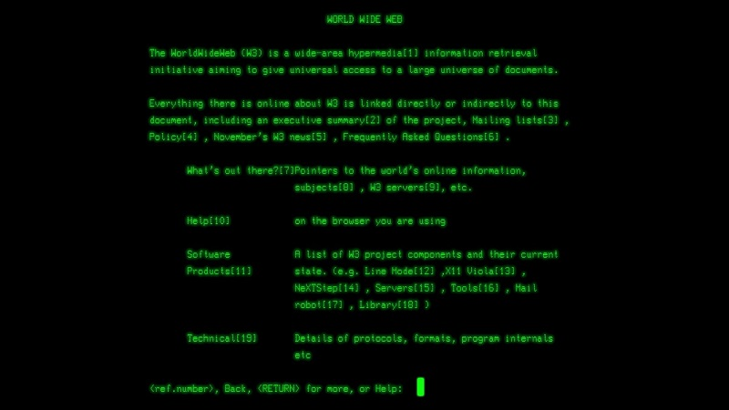

# Marcando o Primeiro Website do Mundo

Em 1989, um cientista britânico chamado Tim Berners-Lee, inventou a World Wide Web (WWW) enquanto trabalhava no CERN. A partir disso, em dezembro de 1990, um software chamado **World Wide Web**, foi desenvolvido em uma máquina NeXT da Organização Européia de Pesquisa Nuclear (CERN) nos arredores de Genebra, para atender à demanda de compartilhamento automatizado de informações entre cientistas de universidades e institutos em todo o mundo. Este foi apenas o início do que haveríamos de conhecer hoje como "A Web"!

## Ponto de Partida

## Resumo do Projeto

# REFERÊNCIAS

- [The birth of the Web](https://home.cern/science/computing/birth-web)
- [A short history of the Web](https://home.cern/science/computing/birth-web/short-history-web)
- [Line Mode Browser 2013: Revisiting the first universally accessible web browser](http://line-mode.cern.ch/)
