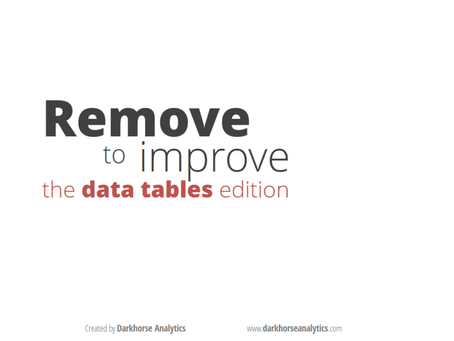

# Tabelas

## Ponto de Partida

Para começar esse exercício e fazer a marcação em HTML você deverá abrir e editar o arquivo [`medalhas_jogos_olimpicos_brasil.html`](medalhas_jogos_olimpicos_brasil.html) disponível na pasta raiz, usando o seu editor de código-fonte favorito, por exemplo:

* [Visual Studio Code](https://code.visualstudio.com/)
* [Atom](https://atom.io/)
* [Sublime](sublimetext.com)

## Resumo do Projeto

Para este projeto, sua tarefa é marcar usando a sintaxe do HTML5, tabelas com dados do [Brasil nos Jogos Olímpicos](https://pt.wikipedia.org/wiki/Brasil_nos_Jogos_Ol%C3%ADmpicos) localizadas na pasta [`data`](data/). Dentro desta pasta, você encontrará cada uma das tabelas no formato texto, que deverão ser acrescentadas no arquivo [`medalhas_jogos_olimpicos_brasil.html`](medalhas_jogos_olimpicos_brasil.html) substituindo os comentários HTML. Para isso, você deverá adicionar corretamente e quando necessário: 

* **Elementos de Tabelas**: `<table>`, `<thead>`, `<tbody>`, `<tfoot>`, `<tr>`, `<th>` e  `<td>`;
* **Atributos de Tabelas:** `colspan` e `rowspan`;
* **Hiperlinks:** `<a>`;
* **Imagens**: ``;
    * Substitua os nomes das colunas: Ouro, Prata, Bronze e Total; pelos respectivos arquivos de imagens (`.svg`) na pasta [`img/medalhas`](img/medalhas)
* **Informações de Estilo Embutido**: atributo `style`.

> **Importante:** Por padrão, o HTML não define as bordas das tabelas e suas células, pois, essa configuração, por se tratar de formatação, deve ser feita somente via CSS. Para facilitar a realização deste projeto e  melhorar a visualização das tabelas nos navegadores, foi adicionada a formatação das bordas usando a folha de estilo [`main.css`](css/main.css).

## Dicas & Sugestões

* Use o [validador HTML](https://validator.w3.org/) do W3C para validar seu HTML;
* Consulte a lista de [elementos HTML](https://developer.mozilla.org/pt-BR/docs/Web/HTML/Element) para obter informações detalhadas sobre cada tag e atributos.

## REFERÊNCIAS

* [Tabular Data - W3C](https://www.w3.org/TR/html50/tabular-data.html)
* [Tables - W3C](https://www.w3.org/TR/html401/struct/tables.html)
* [`<table>`: The Table Element ](https://developer.mozilla.org/en-US/docs/Web/HTML/Element/table)
* [Brasil nos Jogos Olímpicos](https://pt.wikipedia.org/wiki/Brasil_nos_Jogos_Ol%C3%ADmpicos)

